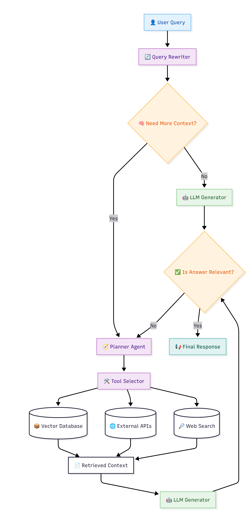

# Agentic Financial RAG (Prodapt)

This is an agentic RAG system built to analyze and compare financial data from Indian IT giants (Infosys, Accenture, Cognizant) for FY22–FY25. It uses a multi-step reasoning loop to decompose complex queries into structured SQL lookups, unstructured semantic searches, and live web queries.

### Why this Corpus?
We selected **Corporate Financial Reports** over simpler datasets (like IPL or Movies) because:
1.  **Hybrid Data Requirements**: Successfully answering a question like "Compare the impact of AI on operating margins for Infosys vs Accenture" requires both precision numerical data (SQLite) and thematic extraction from narrative text (Vector DB).
2.  **Comparative Complexity**: Financial analysis often requires cross-referencing multiple companies and multiple years, which tests the agent's ability to plan multi-step tool calls.
3.  **High Stakes Accuracy**: Financial data has a clear "ground truth," making it easier to identify hallucinations and evaluate the effectiveness of the reasoning loop.

---

## Technical Architecture



The agent follows a deterministic pre-processing stage followed by an autonomous loop:
1.  **Query Rewrite**: Normalizes aliases (e.g., "CTS" → "Cognizant") and cleans conversational noise.
2.  **Gate Check**: A classifier that filters out trivial chat ("Hello"), out-of-scope requests ("Who won the IPL?"), or investment advice.
3.  **The Loop (Max 8 Steps)**:
    -   **Planner**: Decides the next tool based on the current context.
    -   **Executor**: Calls `query_data.py` (NL-to-SQL), `search_docs.py` (FAISS Vector Search), or `web_search.py` (Tavily).
    -   **Sufficiency Check**: LLM determines if gathered context is enough to answer.
4.  **Answer Synthesis**: Composes the final response with citations and a full execution trace.

---

## Setup

### 1. Requirements
Ensure you have Python 3.10+ and the following API keys:
- **Groq API Key**: For LLM inference (Llama 3.3-70b & 3.1-8b).
- **Tavily API Key**: For live web search.

### 2. Installation
```bash
pip install -r requirements.txt
```

### 3. Configuration
Create a `.env` file from the template:
```bash
cp .env.example .env
# Edit .env with your GROQ_API_KEY and TAVILY_API_KEY
```

### 4. Data Ingestion (Initial Run)
If the databases and indexes are not present, run:
```bash
python scripts/ingest_unstructure.py  # Builds FAISS index from MD reports
python scripts/ingest_structure.py    # Builds SQLite financials.db
```

---

## Running the Agent

### Command Line Interface
Run the main agent with any natural language question:
```bash
python agent.py "How did Infosys revenue growth in FY24 compare to its headcount trend?"
```

To see the step-by-step reasoning (the "Trace"):
```bash
python agent.py "What is the current stock price of Accenture?" --trace
```

---

## Evaluation

We include a technical evaluation suite to verify agent performance across different query types (Structured, Unstructured, Web, and Gatekeeping).

### Running Evaluation
```bash
python evaluate.py
```
This script runs a battery of test cases and validates:
- **Keywords**: Presence of critical facts in the response.
- **Status codes**: Ensuring the agent correctly identifies successful vs. refused queries.
- **Latency**: Tracking performance across the multi-step loop.

Results are saved to `eval_results.json`.

---

## Known Failure Modes (Honest Assessment)

Engineers should be aware of the following limitations:
1.  **SQL Aggregation Limits**: The NL-to-SQL tool (`query_data.py`) can sometimes hallucinate complex `JOIN` or `LAG()` window functions when calculating YoY growth if the user's question is ambiguous.
2.  **Vector Search Noise**: In `search_docs.py`, very dense financial documents can lead to "semantic overlap" where the top-k chunks are relevant but don't contain the specific numeric detail requested.
3.  **Rate Limiting**: The free tiers of Groq and Tavily have tight RPM (Requests Per Minute) limits. The agent includes a fallback mechanism (switching from 70b to 8b models), but hitting these limits can still cause 10-30s latencies.
4.  **Hallucination in Citations**: While the agent is instructed to only use provided context, it may occasionally "smoothen" numbers from different quarters into a single narrative if the tool outputs are conflicting.
5.  **Multi-Company Ambiguity**: If you ask "Compare revenue for all companies," the agent might stop after fetching two if it deems the context "sufficient," missing the third.
